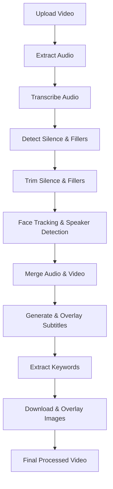

# **🎬 AI Video Editor**  
An **open-source** AI-powered video editor that removes silence, adds subtitles, overlays relevant images, and enhances videos automatically.

## **🌟 Features**  
✅ **Filler & Silence Removal** - Removes unwanted pauses & filler words.  
✅ **Face Tracking & Smart Cropping** - Automatically focuses on speakers.  
✅ **Live Subtitles** - Generates accurate subtitles in real-time.  
✅ **Keyword-Based Image Overlay** - Finds relevant images & places them in the video.  

---

## **🚀 Upcoming Features**  
🔜 **End-to-End Automation** - Just **type a prompt**, and the video edits itself!  
🔜 **Locally Run LLMs** - No API requests needed, making video editing even faster!  

---

## **📌 How It Works?**  
Below is a high-level overview of how the AI Video Editor processes videos:  



Each step is explained in detail in the **notebooks/** folder.  

---

## **🛠️ Installation**  

### **1️⃣ Clone the Repository**  
```bash
git clone https://github.com/end-9214/AI-Video_editor.git
cd AI-Video_editor
```

### **2️⃣ Create a Virtual Environment & Install Dependencies**  
```bash
python -m venv venv
source venv/bin/activate  # On macOS/Linux
venv\Scripts\activate     # On Windows

pip install -r requirements.txt
```

### **3️⃣ Check if PyTorch is CUDA-Enabled**  
Before running the project, ensure that PyTorch is installed with CUDA support:  
```python
import torch
print("CUDA Available:", torch.cuda.is_available())
```
If `False`, install the correct PyTorch version:  
```bash
pip uninstall torch torchvision torchaudio
pip install torch torchvision torchaudio --index-url https://download.pytorch.org/whl/cu118
```

### **4️⃣ Add Your API Key**  
Create a `.env` file inside the `Scripts/` folder:  
```bash
touch Scripts/.env
```
Open the file and add:  
```
GROQ_API_KEY=your_api_key_here
```

### **5️⃣ Run the App**  
```bash
streamlit run app.py
```

---

## **📂 Project Structure**  
```
AI-Video-Editor/
│── app.py                  # Streamlit App
│── requirements.txt         # Required Dependencies
│── processed_videos/        # Stores intermediate processing files
│── final_outputs/           # Stores final processed videos
│── notebooks/               # Detailed explanations of each step
│── Scripts/                 # All processing scripts
│   ├── Convert_to_Audio.py
│   ├── Transcription_script.py
│   ├── Silence_and_fillers_removal.py
│   ├── Face_Tracking.py
│   ├── Generate_Subtitles.py
│   ├── Overlay_Images.py
│   ├── .env                 # Store API keys here
│   └── ...
└── README.md                # Project Documentation
```

---

## **📖 Understanding Each Step**  
Each processing step has been explained in **Jupyter notebooks** inside the **notebooks/** folder.  
You can check them out if you want to understand the logic behind each step.  

📌 **Example Notebooks:**  
- `notebooks/01_AI_Trim.ipynb`  
- `notebooks/02_Face_Subtitles_and_Images.ipynb`  

---

## **📊 Results**  
Here are some example results from the AI Video Editor:  
  


---

## **🎯 Vision**  
> **The goal of this project is to make video editing as simple as typing a prompt!**  
> This AI-powered tool automates the entire process, allowing users to **edit videos in no time.** 🚀  

🆕 **Upcoming Feature:**  
✅ **Locally Run LLMs** - No API requests needed! This will make video processing faster and remove API limitations.  

---

## **💡 Contributing**  
This project is **open-source** and welcomes contributions from everyone!  
If you have new ideas or improvements, feel free to open a PR. 🚀  

---

## **📧 Contact**  
If you have any questions, feel free to reach out!  
📩 Email: [karamveersingh2003111@gmail.com](mailto:karamveersingh2003111@gmail.com)  
🌍 GitHub: [end-9214](https://github.com/end-9214)

